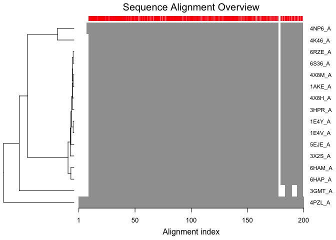
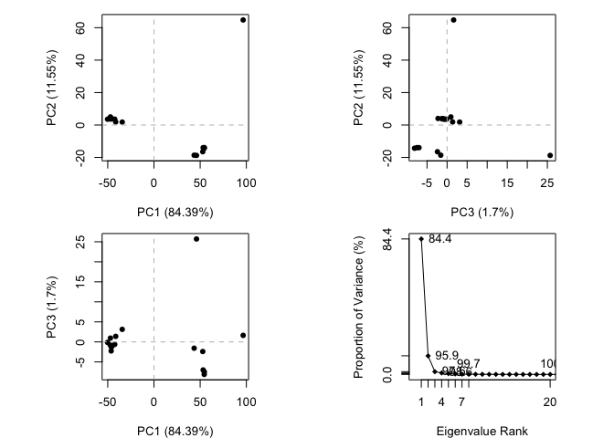
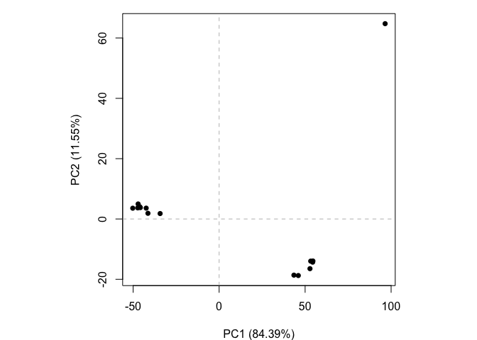
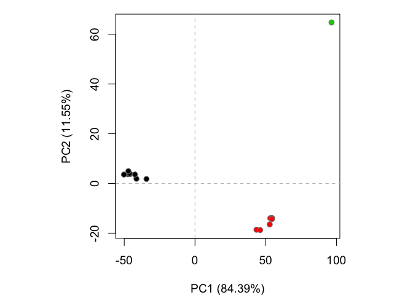

Structural Bioinformatics (pt.1)
================
Rachael McVicar
2/14/2020

## PDB Statistics

Download a CSV file from the PDB site (accessible from “Analyze” \> “PDB
Statistics” \> “by Experimental Method and Molecular Type”. Move this
CSV file into your RStudio project and use it to answer the following
questions:

> Q: What percentage of structures in the PDB are solved by X-Ray and
> Electron Microscopy.

``` r
stats <- read.csv("Data Export Summary.csv")
stats
```

    ##   Experimental.Method Proteins Nucleic.Acids Protein.NA.Complex Other  Total
    ## 1               X-Ray   133756          2086               6884     8 142734
    ## 2                 NMR    11308          1317                265     8  12898
    ## 3 Electron Microscopy     3241            35               1095     0   4371
    ## 4               Other      284             4                  6    13    307
    ## 5        Multi Method      146             5                  2     1    154

``` r
#I want to change row names, so....
stats <- read.csv("Data Export Summary.csv", row.names = 1)
```

``` r
stats[1, 1]/sum(stats$Proteins)
```

    ## [1] 0.8992907

``` r
stats[1, 3]/sum(stats$Proteins)
```

    ## [1] 0.04628366

``` r
(stats[1, 1]+stats[1,3])/sum(stats$Proteins)
```

    ## [1] 0.9455743

Shoot, I want total structures, not just protein structures:b

``` r
stats[1, 1]/sum(stats$Total) * 100
```

    ## [1] 83.35577

``` r
stats[1, 3]/sum(stats$Total) * 100
```

    ## [1] 4.290059

``` r
(stats[1, 1]+stats[1,3])/sum(stats$Total) * 100
```

    ## [1] 87.64583

I wanna make it purdy, so round it vvvv

``` r
ans<- round(stats$Total/sum(stats$Total) * 100, 2)
names(ans)<- rownames(stats)
ans
```

    ##               X-Ray                 NMR Electron Microscopy               Other 
    ##               88.95                8.04                2.72                0.19 
    ##        Multi Method 
    ##                0.10

> Q: What proportion of structures in the PDB are protein? \[1\]
> 92.69057 I might have already started answering it, woops

``` r
x_ray <- round(stats[1, 1]/sum(stats$Proteins) * 100, 2)
electron_microscopystats <- round(stats[1, 3]/sum(stats$Proteins) * 100, 2)
x_ray
```

    ## [1] 89.93

``` r
electron_microscopystats
```

    ## [1] 4.63

just realized I didn’t answer the question, yikes

``` r
round(sum(stats$Proteins)/sum(stats$Total) * 100, 2)
```

    ## [1] 92.69

> Q: Type HIV in the PDB website search box on the home page and
> determine how many HIV-1 protease structures are in the current PDB?
> This is an R Markdown document. Markdown is a simple formatting syntax
> for authoring HTML, PDF, and MS Word documents. For more details on
> using R Markdown see <http://rmarkdown.rstudio.com>.

\#\#Using bio3d to analyse protein structure data

Use the bio3d package from CRAN, it’s already installed

``` r
library(bio3d)
pdb <- read.pdb("1hsg")
```

    ##   Note: Accessing on-line PDB file

``` r
pdb
```

    ## 
    ##  Call:  read.pdb(file = "1hsg")
    ## 
    ##    Total Models#: 1
    ##      Total Atoms#: 1686,  XYZs#: 5058  Chains#: 2  (values: A B)
    ## 
    ##      Protein Atoms#: 1514  (residues/Calpha atoms#: 198)
    ##      Nucleic acid Atoms#: 0  (residues/phosphate atoms#: 0)
    ## 
    ##      Non-protein/nucleic Atoms#: 172  (residues: 128)
    ##      Non-protein/nucleic resid values: [ HOH (127), MK1 (1) ]
    ## 
    ##    Protein sequence:
    ##       PQITLWQRPLVTIKIGGQLKEALLDTGADDTVLEEMSLPGRWKPKMIGGIGGFIKVRQYD
    ##       QILIEICGHKAIGTVLVGPTPVNIIGRNLLTQIGCTLNFPQITLWQRPLVTIKIGGQLKE
    ##       ALLDTGADDTVLEEMSLPGRWKPKMIGGIGGFIKVRQYDQILIEICGHKAIGTVLVGPTP
    ##       VNIIGRNLLTQIGCTLNF
    ## 
    ## + attr: atom, xyz, seqres, helix, sheet,
    ##         calpha, remark, call

I wanna make it lung based, let’s bring in Dr.Leibel’s favorite molecule
SURFACTANT PROTEIN WOOOO (D instead of B though)

``` r
library(bio3d)
pdb <- read.pdb("1ake")
```

    ##   Note: Accessing on-line PDB file
    ##    PDB has ALT records, taking A only, rm.alt=TRUE

``` r
pdb
```

    ## 
    ##  Call:  read.pdb(file = "1ake")
    ## 
    ##    Total Models#: 1
    ##      Total Atoms#: 3804,  XYZs#: 11412  Chains#: 2  (values: A B)
    ## 
    ##      Protein Atoms#: 3312  (residues/Calpha atoms#: 428)
    ##      Nucleic acid Atoms#: 0  (residues/phosphate atoms#: 0)
    ## 
    ##      Non-protein/nucleic Atoms#: 492  (residues: 380)
    ##      Non-protein/nucleic resid values: [ AP5 (2), HOH (378) ]
    ## 
    ##    Protein sequence:
    ##       MRIILLGAPGAGKGTQAQFIMEKYGIPQISTGDMLRAAVKSGSELGKQAKDIMDAGKLVT
    ##       DELVIALVKERIAQEDCRNGFLLDGFPRTIPQADAMKEAGINVDYVLEFDVPDELIVDRI
    ##       VGRRVHAPSGRVYHVKFNPPKVEGKDDVTGEELTTRKDDQEETVRKRLVEYHQMTAPLIG
    ##       YYSKEAEAGNTKYAKVDGTKPVAEVRADLEKILGMRIILLGAPGA...<cut>...KILG
    ## 
    ## + attr: atom, xyz, seqres, helix, sheet,
    ##         calpha, remark, call

``` r
attributes(pdb)
```

    ## $names
    ## [1] "atom"   "xyz"    "seqres" "helix"  "sheet"  "calpha" "remark" "call"  
    ## 
    ## $class
    ## [1] "pdb" "sse"

``` r
head(pdb$atom)
```

    ##   type eleno elety  alt resid chain resno insert      x      y      z o     b
    ## 1 ATOM     1     N <NA>   MET     A     1   <NA> 26.981 53.977 40.085 1 40.83
    ## 2 ATOM     2    CA <NA>   MET     A     1   <NA> 26.091 52.849 39.889 1 37.14
    ## 3 ATOM     3     C <NA>   MET     A     1   <NA> 26.679 52.163 38.675 1 30.15
    ## 4 ATOM     4     O <NA>   MET     A     1   <NA> 27.020 52.865 37.715 1 27.59
    ## 5 ATOM     5    CB <NA>   MET     A     1   <NA> 24.677 53.310 39.580 1 38.06
    ## 6 ATOM     6    CG <NA>   MET     A     1   <NA> 23.624 52.189 39.442 1 46.67
    ##   segid elesy charge
    ## 1  <NA>     N   <NA>
    ## 2  <NA>     C   <NA>
    ## 3  <NA>     C   <NA>
    ## 4  <NA>     O   <NA>
    ## 5  <NA>     C   <NA>
    ## 6  <NA>     C   <NA>

> Q: How many amino acid residues are there in this pdb object? 11412

> Q: Name one of the two non-protein residues? \[ AP5 (2), HOH (378) \]

> Q: How many protein chains are in this structure? Chains\#: 2 (values:
> A B)

``` r
library(bio3d)
pdb <- read.pdb("1ake")
```

    ##   Note: Accessing on-line PDB file

    ## Warning in get.pdb(file, path = tempdir(), verbose = FALSE): /var/folders/w1/
    ## dt5r2p490v909vgp9lxyj8lr0000gn/T//Rtmp4y2fg4/1ake.pdb exists. Skipping download

    ##    PDB has ALT records, taking A only, rm.alt=TRUE

``` r
pdb
```

    ## 
    ##  Call:  read.pdb(file = "1ake")
    ## 
    ##    Total Models#: 1
    ##      Total Atoms#: 3804,  XYZs#: 11412  Chains#: 2  (values: A B)
    ## 
    ##      Protein Atoms#: 3312  (residues/Calpha atoms#: 428)
    ##      Nucleic acid Atoms#: 0  (residues/phosphate atoms#: 0)
    ## 
    ##      Non-protein/nucleic Atoms#: 492  (residues: 380)
    ##      Non-protein/nucleic resid values: [ AP5 (2), HOH (378) ]
    ## 
    ##    Protein sequence:
    ##       MRIILLGAPGAGKGTQAQFIMEKYGIPQISTGDMLRAAVKSGSELGKQAKDIMDAGKLVT
    ##       DELVIALVKERIAQEDCRNGFLLDGFPRTIPQADAMKEAGINVDYVLEFDVPDELIVDRI
    ##       VGRRVHAPSGRVYHVKFNPPKVEGKDDVTGEELTTRKDDQEETVRKRLVEYHQMTAPLIG
    ##       YYSKEAEAGNTKYAKVDGTKPVAEVRADLEKILGMRIILLGAPGA...<cut>...KILG
    ## 
    ## + attr: atom, xyz, seqres, helix, sheet,
    ##         calpha, remark, call

Adenylate kinase structures from the PDB Search and retrieve ADK
structures

``` r
hits <- NULL
hits$pdb.id <- c('1AKE_A','4X8M_A','6S36_A','6RZE_A','4X8H_A','3HPR_A','1E4V_A','5EJE_A','1E4Y_A','3X2S_A','6HAP_A','6HAM_A','4K46_A','4NP6_A','3GMT_A','4PZL_A')
```

Download and parse these structures

``` r
#Download related PDB files
files <- get.pdb(hits$pdb.id, path="pdbs", split=TRUE, gzip=TRUE)
```

    ## Warning in get.pdb(hits$pdb.id, path = "pdbs", split = TRUE, gzip = TRUE): pdbs/
    ## 1AKE.pdb.gz exists. Skipping download

    ## Warning in get.pdb(hits$pdb.id, path = "pdbs", split = TRUE, gzip = TRUE): pdbs/
    ## 4X8M.pdb.gz exists. Skipping download

    ## Warning in get.pdb(hits$pdb.id, path = "pdbs", split = TRUE, gzip = TRUE): pdbs/
    ## 6S36.pdb.gz exists. Skipping download

    ## Warning in get.pdb(hits$pdb.id, path = "pdbs", split = TRUE, gzip = TRUE): pdbs/
    ## 6RZE.pdb.gz exists. Skipping download

    ## Warning in get.pdb(hits$pdb.id, path = "pdbs", split = TRUE, gzip = TRUE): pdbs/
    ## 4X8H.pdb.gz exists. Skipping download

    ## Warning in get.pdb(hits$pdb.id, path = "pdbs", split = TRUE, gzip = TRUE): pdbs/
    ## 3HPR.pdb.gz exists. Skipping download

    ## Warning in get.pdb(hits$pdb.id, path = "pdbs", split = TRUE, gzip = TRUE): pdbs/
    ## 1E4V.pdb.gz exists. Skipping download

    ## Warning in get.pdb(hits$pdb.id, path = "pdbs", split = TRUE, gzip = TRUE): pdbs/
    ## 5EJE.pdb.gz exists. Skipping download

    ## Warning in get.pdb(hits$pdb.id, path = "pdbs", split = TRUE, gzip = TRUE): pdbs/
    ## 1E4Y.pdb.gz exists. Skipping download

    ## Warning in get.pdb(hits$pdb.id, path = "pdbs", split = TRUE, gzip = TRUE): pdbs/
    ## 3X2S.pdb.gz exists. Skipping download

    ## Warning in get.pdb(hits$pdb.id, path = "pdbs", split = TRUE, gzip = TRUE): pdbs/
    ## 6HAP.pdb.gz exists. Skipping download

    ## Warning in get.pdb(hits$pdb.id, path = "pdbs", split = TRUE, gzip = TRUE): pdbs/
    ## 6HAM.pdb.gz exists. Skipping download

    ## Warning in get.pdb(hits$pdb.id, path = "pdbs", split = TRUE, gzip = TRUE): pdbs/
    ## 4K46.pdb.gz exists. Skipping download

    ## Warning in get.pdb(hits$pdb.id, path = "pdbs", split = TRUE, gzip = TRUE): pdbs/
    ## 4NP6.pdb.gz exists. Skipping download

    ## Warning in get.pdb(hits$pdb.id, path = "pdbs", split = TRUE, gzip = TRUE): pdbs/
    ## 3GMT.pdb.gz exists. Skipping download

    ## Warning in get.pdb(hits$pdb.id, path = "pdbs", split = TRUE, gzip = TRUE): pdbs/
    ## 4PZL.pdb.gz exists. Skipping download

    ##   |                                                                              |                                                                      |   0%  |                                                                              |====                                                                  |   6%  |                                                                              |=========                                                             |  12%  |                                                                              |=============                                                         |  19%  |                                                                              |==================                                                    |  25%  |                                                                              |======================                                                |  31%  |                                                                              |==========================                                            |  38%  |                                                                              |===============================                                       |  44%  |                                                                              |===================================                                   |  50%  |                                                                              |=======================================                               |  56%  |                                                                              |============================================                          |  62%  |                                                                              |================================================                      |  69%  |                                                                              |====================================================                  |  75%  |                                                                              |=========================================================             |  81%  |                                                                              |=============================================================         |  88%  |                                                                              |==================================================================    |  94%  |                                                                              |======================================================================| 100%

Align and superpose structures

``` r
# Align releated PDBs
pdbs <- pdbaln(files, fit = TRUE, exefile="msa")
```

    ## Reading PDB files:
    ## pdbs/split_chain/1AKE_A.pdb
    ## pdbs/split_chain/4X8M_A.pdb
    ## pdbs/split_chain/6S36_A.pdb
    ## pdbs/split_chain/6RZE_A.pdb
    ## pdbs/split_chain/4X8H_A.pdb
    ## pdbs/split_chain/3HPR_A.pdb
    ## pdbs/split_chain/1E4V_A.pdb
    ## pdbs/split_chain/5EJE_A.pdb
    ## pdbs/split_chain/1E4Y_A.pdb
    ## pdbs/split_chain/3X2S_A.pdb
    ## pdbs/split_chain/6HAP_A.pdb
    ## pdbs/split_chain/6HAM_A.pdb
    ## pdbs/split_chain/4K46_A.pdb
    ## pdbs/split_chain/4NP6_A.pdb
    ## pdbs/split_chain/3GMT_A.pdb
    ## pdbs/split_chain/4PZL_A.pdb
    ##    PDB has ALT records, taking A only, rm.alt=TRUE
    ## ..   PDB has ALT records, taking A only, rm.alt=TRUE
    ## .   PDB has ALT records, taking A only, rm.alt=TRUE
    ## ..   PDB has ALT records, taking A only, rm.alt=TRUE
    ## ..   PDB has ALT records, taking A only, rm.alt=TRUE
    ## ....   PDB has ALT records, taking A only, rm.alt=TRUE
    ## .   PDB has ALT records, taking A only, rm.alt=TRUE
    ## ....
    ## 
    ## Extracting sequences
    ## 
    ## pdb/seq: 1   name: pdbs/split_chain/1AKE_A.pdb 
    ##    PDB has ALT records, taking A only, rm.alt=TRUE
    ## pdb/seq: 2   name: pdbs/split_chain/4X8M_A.pdb 
    ## pdb/seq: 3   name: pdbs/split_chain/6S36_A.pdb 
    ##    PDB has ALT records, taking A only, rm.alt=TRUE
    ## pdb/seq: 4   name: pdbs/split_chain/6RZE_A.pdb 
    ##    PDB has ALT records, taking A only, rm.alt=TRUE
    ## pdb/seq: 5   name: pdbs/split_chain/4X8H_A.pdb 
    ## pdb/seq: 6   name: pdbs/split_chain/3HPR_A.pdb 
    ##    PDB has ALT records, taking A only, rm.alt=TRUE
    ## pdb/seq: 7   name: pdbs/split_chain/1E4V_A.pdb 
    ## pdb/seq: 8   name: pdbs/split_chain/5EJE_A.pdb 
    ##    PDB has ALT records, taking A only, rm.alt=TRUE
    ## pdb/seq: 9   name: pdbs/split_chain/1E4Y_A.pdb 
    ## pdb/seq: 10   name: pdbs/split_chain/3X2S_A.pdb 
    ## pdb/seq: 11   name: pdbs/split_chain/6HAP_A.pdb 
    ## pdb/seq: 12   name: pdbs/split_chain/6HAM_A.pdb 
    ##    PDB has ALT records, taking A only, rm.alt=TRUE
    ## pdb/seq: 13   name: pdbs/split_chain/4K46_A.pdb 
    ##    PDB has ALT records, taking A only, rm.alt=TRUE
    ## pdb/seq: 14   name: pdbs/split_chain/4NP6_A.pdb 
    ## pdb/seq: 15   name: pdbs/split_chain/3GMT_A.pdb 
    ## pdb/seq: 16   name: pdbs/split_chain/4PZL_A.pdb

``` r
# Vector containing PDB codes for figure axis
ids <- basename.pdb(pdbs$id)

# Draw schematic alignment
plot(pdbs, labels=ids)
```

<!-- -->

Viewing these superposed structures We can view our superposed results
with the new bio3d.view view() function:

\#\#library(bio3d.view) \#\#library(rgl) \#\#view(pdbs) I can’t view it,
I give up, I feel like I’m going around in circles

``` r
pc<- pca(pdbs)
plot(pc)
```

<!-- -->

# Perform PCA

``` r
pc.xray <- pca(pdbs)
plot(pc.xray)
```

<!-- -->

``` r
plot(pc, 1:2)
```

<!-- -->

``` r
dim(pc$U)
```

    ## [1] 612 612

# Calculate RMSD

``` r
rd <- rmsd(pdbs)
```

    ## Warning in rmsd(pdbs): No indices provided, using the 204 non NA positions

# Structure-based clustering

``` r
hc.rd <- hclust(dist(rd))
grps.rd <- cutree(hc.rd, k=3)

plot(pc.xray, 1:2, col="grey50", bg=grps.rd, pch=21, cex=1)
```

<!-- -->

# Visualize first principal component

``` r
pc1 <- mktrj(pc.xray, pc=1, file="pc_1.pdb")
```

``` r
View(pc1)
```

    ## Warning in system2("/usr/bin/otool", c("-L", shQuote(DSO)), stdout = TRUE):
    ## running command ''/usr/bin/otool' -L '/Library/Frameworks/R.framework/Resources/
    ## modules/R_de.so'' had status 1

``` r
#res <- read.pdb("all.pdbqt", multi=TRUE)
#write.pdb(res, "results.pdb")
```
