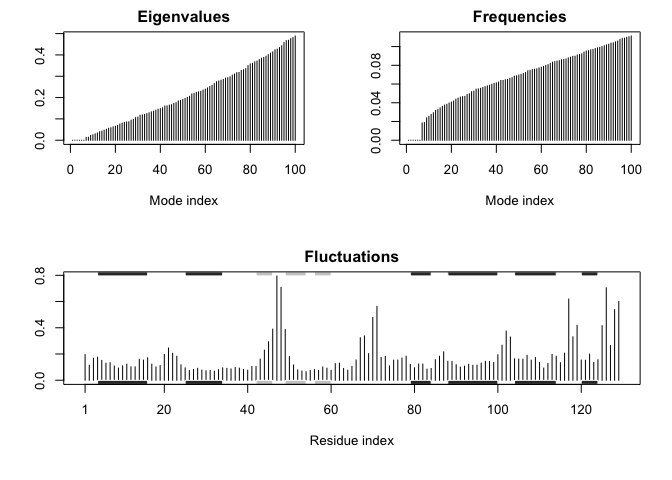

Structure based drug design
================

## Section 1: In silico docking of drugs to HIV-1 protease

Me: First, when we import the protein structure from PDB (it will be
bound to a compound), we want to separate the protein structure from
that molecule.

Barry: Here we download and clean up the HIV-Pr structure(PDB: 1HSG)
from PDB. Make a separate set of “protein only” and “ligand only” files.

``` r
library(bio3d)
file.name<- get.pdb("1HSG")
```

    ## Warning in get.pdb("1HSG"): ./1HSG.pdb exists. Skipping download

``` r
file.name
```

    ## [1] "./1HSG.pdb"

We’ll use `read.pdb`, `atom.select()`, and write `write.pdb()` functions
to make our separate “protein only” and “ligand only” file

``` r
read.pdb("1HSG")
```

    ##   Note: Accessing on-line PDB file

    ## 
    ##  Call:  read.pdb(file = "1HSG")
    ## 
    ##    Total Models#: 1
    ##      Total Atoms#: 1686,  XYZs#: 5058  Chains#: 2  (values: A B)
    ## 
    ##      Protein Atoms#: 1514  (residues/Calpha atoms#: 198)
    ##      Nucleic acid Atoms#: 0  (residues/phosphate atoms#: 0)
    ## 
    ##      Non-protein/nucleic Atoms#: 172  (residues: 128)
    ##      Non-protein/nucleic resid values: [ HOH (127), MK1 (1) ]
    ## 
    ##    Protein sequence:
    ##       PQITLWQRPLVTIKIGGQLKEALLDTGADDTVLEEMSLPGRWKPKMIGGIGGFIKVRQYD
    ##       QILIEICGHKAIGTVLVGPTPVNIIGRNLLTQIGCTLNFPQITLWQRPLVTIKIGGQLKE
    ##       ALLDTGADDTVLEEMSLPGRWKPKMIGGIGGFIKVRQYDQILIEICGHKAIGTVLVGPTP
    ##       VNIIGRNLLTQIGCTLNF
    ## 
    ## + attr: atom, xyz, seqres, helix, sheet,
    ##         calpha, remark, call

``` r
hiv<- read.pdb(file.name)
?atom.select
```

``` r
hiv.protein.only<- atom.select(hiv, "protein", value=TRUE)
hiv.ligand.only<- atom.select(hiv, "ligand", value=TRUE)
```

``` r
?write.pdb
write.pdb(hiv.protein.only, file="1HSG_protein.pdb")
write.pdb(hiv.ligand.only, file="1HSG_ligand.pdb")
```

\#\#Section 2: Docking ligands into HIV-1 protease

The next step is to use AutoDockTools to setup protein docking input
Need hydrogens to calculate energies when docking, done through
“AutoDockTools” charge and atom-type is the difference between .pdbqt
vs .pdb files (charge & type)

``` r
res <- read.pdb("all.pdbqt", multi=TRUE)
write.pdb(res, "results.pdb")
```

``` r
library(bio3d)
res <- read.pdb("all.pdbqt", multi= TRUE)
write.pdb(res, "results.pdb")
```

``` r
res <- read.pdb("all.pdbqt", multi=TRUE)
ori <- read.pdb("ligand.pdbqt")
rmsd(ori, res)
```

    ##  [1]  0.673  4.076 10.423  5.461 10.763 10.773 10.463  2.645 10.701 10.614
    ## [11] 11.536 11.137 11.029 10.584 11.227

## Section 3: Exploring the conformational dynamics of proteins

Normal mode analysis (NMA) is one of the major simulation techniques
used to probe largescale motions in biomolecules. Typical application is
for the prediction of functional motions in proteins.

Normal mode analysis (NMA) of a single protein structure can be carried
out by providing a PDB object to the function nma().

In the code below we first load the Bio3D package and then download an
example structure of hen egg white lysozyme (PDB id 1hel) with the
function read.pdb(). Finally the function nma() is used perform the
normal mode calculation:

``` r
library(bio3d)
pdb <- read.pdb("1HEL")
```

    ##   Note: Accessing on-line PDB file

``` r
modes <- nma(pdb)
```

    ##  Building Hessian...     Done in 0.02 seconds.
    ##  Diagonalizing Hessian...    Done in 0.149 seconds.

``` r
plot(modes, sse=pdb)
```

<!-- -->

To visualize the normal mode predicted structural variations we can use
the function mktrj() to generate a trajectory PDB file by interpolating
along a given normal mode:

``` r
# Visualize NMA results
mktrj(modes, mode=7, file="nma_7.pdb")
```
