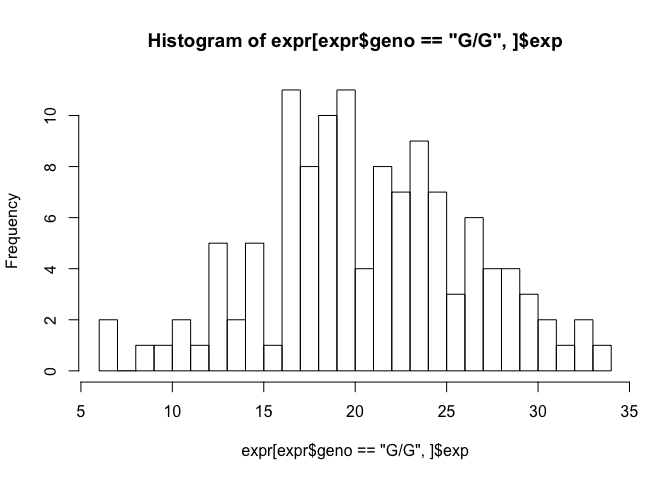
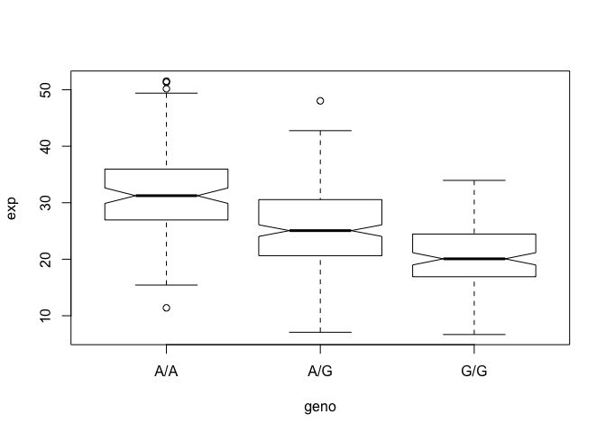
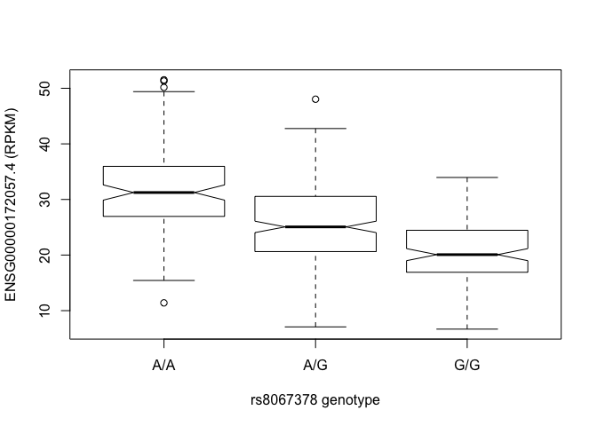
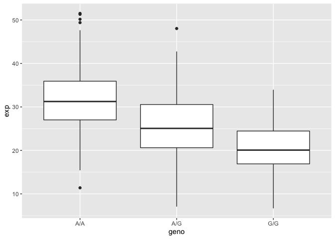
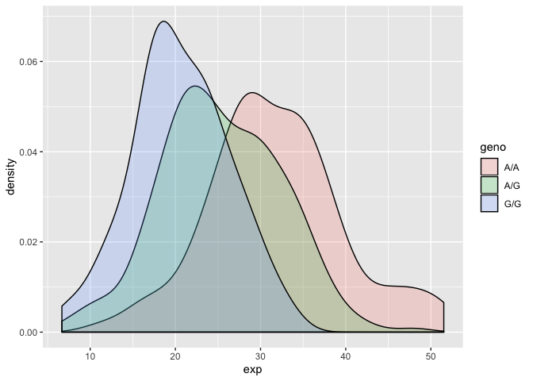
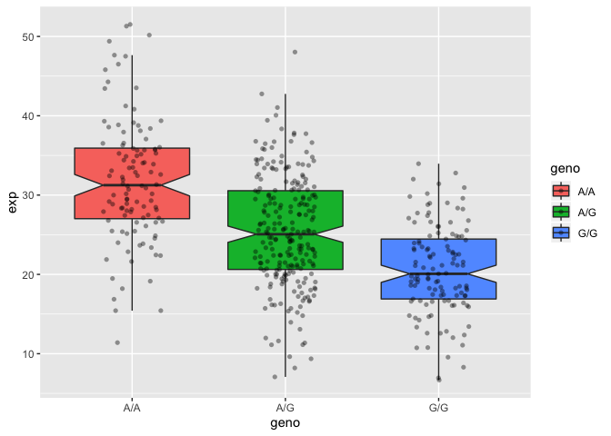

Lecture 15
================
Rachael McVicar
2/26/2020

## Read sample genotypes data from ENSEMBL

We downloaded genotype data from ENSMEBLE on the MXL Mexican Ancestry in
LA

``` r
mxl<- read.csv("373531-SampleGenotypes-Homo_sapiens_Variation_Sample_rs8067378.csv")
head(mxl)
```

    ##   Sample..Male.Female.Unknown. Genotype..forward.strand. Population.s. Father
    ## 1                  NA19648 (F)                       A|A ALL, AMR, MXL      -
    ## 2                  NA19649 (M)                       G|G ALL, AMR, MXL      -
    ## 3                  NA19651 (F)                       A|A ALL, AMR, MXL      -
    ## 4                  NA19652 (M)                       G|G ALL, AMR, MXL      -
    ## 5                  NA19654 (F)                       G|G ALL, AMR, MXL      -
    ## 6                  NA19655 (M)                       A|G ALL, AMR, MXL      -
    ##   Mother
    ## 1      -
    ## 2      -
    ## 3      -
    ## 4      -
    ## 5      -
    ## 6      -

RM:I’m only interested in the Genotype. forward, strand BG: We want to
look at the second column that comtaains the genotype information

``` r
table(mxl$Genotype..forward.strand.)
```

    ## 
    ## A|A A|G G|A G|G 
    ##  22  21  12   9

\#\#RNA-Seq result analysis for the different genotypes of this SNP

``` r
expr<- read.table("rs8067378_ENSG00000172057.6 (1).txt")
head(expr)
```

    ##    sample geno      exp
    ## 1 HG00367  A/G 28.96038
    ## 2 NA20768  A/G 20.24449
    ## 3 HG00361  A/A 31.32628
    ## 4 HG00135  A/A 34.11169
    ## 5 NA18870  G/G 18.25141
    ## 6 NA11993  A/A 32.89721

Does the expression change based on phenotype expr$geno, A/A, A/G, G/A,
G/G

``` r
expr$geno == "G/G"
```

    ##   [1] FALSE FALSE FALSE FALSE  TRUE FALSE FALSE FALSE  TRUE FALSE FALSE FALSE
    ##  [13] FALSE FALSE FALSE FALSE  TRUE FALSE FALSE  TRUE FALSE FALSE  TRUE FALSE
    ##  [25] FALSE FALSE FALSE  TRUE  TRUE FALSE  TRUE  TRUE FALSE FALSE  TRUE FALSE
    ##  [37] FALSE FALSE FALSE FALSE  TRUE FALSE FALSE FALSE FALSE  TRUE  TRUE FALSE
    ##  [49]  TRUE  TRUE FALSE FALSE FALSE FALSE FALSE  TRUE  TRUE FALSE FALSE FALSE
    ##  [61]  TRUE FALSE FALSE FALSE FALSE FALSE FALSE FALSE FALSE FALSE FALSE  TRUE
    ##  [73]  TRUE FALSE FALSE FALSE  TRUE FALSE  TRUE FALSE FALSE FALSE FALSE FALSE
    ##  [85]  TRUE FALSE FALSE FALSE  TRUE FALSE FALSE  TRUE  TRUE FALSE FALSE FALSE
    ##  [97] FALSE FALSE FALSE FALSE FALSE FALSE FALSE  TRUE  TRUE  TRUE FALSE FALSE
    ## [109]  TRUE  TRUE  TRUE FALSE FALSE  TRUE  TRUE FALSE  TRUE  TRUE  TRUE FALSE
    ## [121] FALSE FALSE FALSE FALSE FALSE FALSE FALSE  TRUE FALSE FALSE FALSE  TRUE
    ## [133] FALSE FALSE  TRUE FALSE FALSE FALSE FALSE  TRUE FALSE FALSE  TRUE FALSE
    ## [145] FALSE FALSE FALSE FALSE FALSE  TRUE FALSE FALSE  TRUE FALSE FALSE  TRUE
    ## [157] FALSE FALSE  TRUE FALSE FALSE FALSE  TRUE FALSE FALSE  TRUE FALSE FALSE
    ## [169] FALSE  TRUE  TRUE  TRUE FALSE FALSE  TRUE FALSE FALSE  TRUE FALSE FALSE
    ## [181] FALSE FALSE FALSE FALSE FALSE FALSE FALSE FALSE FALSE  TRUE FALSE FALSE
    ## [193]  TRUE  TRUE  TRUE FALSE FALSE FALSE  TRUE FALSE  TRUE FALSE FALSE FALSE
    ## [205] FALSE FALSE  TRUE FALSE FALSE FALSE  TRUE FALSE FALSE FALSE FALSE FALSE
    ## [217] FALSE  TRUE FALSE FALSE FALSE FALSE FALSE  TRUE  TRUE FALSE FALSE FALSE
    ## [229] FALSE FALSE FALSE  TRUE  TRUE FALSE FALSE FALSE FALSE FALSE  TRUE FALSE
    ## [241]  TRUE FALSE FALSE FALSE FALSE FALSE  TRUE FALSE FALSE  TRUE FALSE FALSE
    ## [253]  TRUE  TRUE FALSE FALSE FALSE FALSE  TRUE FALSE  TRUE FALSE FALSE FALSE
    ## [265] FALSE FALSE  TRUE  TRUE FALSE FALSE  TRUE  TRUE FALSE FALSE FALSE FALSE
    ## [277] FALSE FALSE FALSE  TRUE FALSE FALSE  TRUE FALSE  TRUE FALSE  TRUE  TRUE
    ## [289] FALSE FALSE FALSE  TRUE  TRUE FALSE FALSE FALSE FALSE FALSE  TRUE FALSE
    ## [301] FALSE FALSE FALSE FALSE FALSE FALSE  TRUE  TRUE FALSE FALSE FALSE FALSE
    ## [313] FALSE  TRUE FALSE  TRUE FALSE FALSE  TRUE FALSE FALSE FALSE FALSE FALSE
    ## [325] FALSE FALSE FALSE FALSE FALSE  TRUE FALSE FALSE FALSE FALSE FALSE FALSE
    ## [337] FALSE FALSE FALSE  TRUE FALSE FALSE FALSE  TRUE FALSE FALSE FALSE FALSE
    ## [349] FALSE FALSE  TRUE FALSE FALSE FALSE  TRUE  TRUE  TRUE FALSE FALSE FALSE
    ## [361]  TRUE  TRUE FALSE  TRUE FALSE FALSE FALSE FALSE  TRUE FALSE FALSE FALSE
    ## [373]  TRUE FALSE  TRUE  TRUE FALSE  TRUE  TRUE  TRUE  TRUE FALSE  TRUE FALSE
    ## [385]  TRUE FALSE FALSE FALSE FALSE FALSE  TRUE FALSE  TRUE FALSE FALSE FALSE
    ## [397] FALSE FALSE FALSE FALSE FALSE FALSE FALSE FALSE FALSE FALSE FALSE FALSE
    ## [409] FALSE FALSE FALSE FALSE FALSE FALSE FALSE FALSE FALSE FALSE FALSE FALSE
    ## [421]  TRUE FALSE FALSE FALSE FALSE FALSE FALSE  TRUE FALSE FALSE FALSE FALSE
    ## [433] FALSE FALSE  TRUE  TRUE FALSE FALSE FALSE FALSE FALSE FALSE FALSE FALSE
    ## [445] FALSE  TRUE FALSE FALSE FALSE FALSE FALSE FALSE FALSE  TRUE FALSE FALSE
    ## [457]  TRUE  TRUE FALSE FALSE FALSE FALSE

for every true, I want to find the correlating expression value and find
the average

``` r
summary( expr[expr$geno == "G/G" , ]$exp, breaks=30)
```

    ##    Min. 1st Qu.  Median    Mean 3rd Qu.    Max. 
    ##   6.675  16.903  20.074  20.594  24.457  33.956

``` r
hist( expr[expr$geno == "G/G" , ]$exp, breaks=20)
```

<!-- -->

``` r
summary( expr[expr$geno == "A/G" , ]$exp, breaks=20)
```

    ##    Min. 1st Qu.  Median    Mean 3rd Qu.    Max. 
    ##   7.075  20.626  25.065  25.397  30.552  48.034

``` r
summary( expr[expr$geno == "G/G" , ]$exp, breaks=20)
```

    ##    Min. 1st Qu.  Median    Mean 3rd Qu.    Max. 
    ##   6.675  16.903  20.074  20.594  24.457  33.956

``` r
summary( expr[expr$geno == "G/A" , ]$exp, breaks=20)
```

    ##    Min. 1st Qu.  Median    Mean 3rd Qu.    Max. 
    ## 

``` r
summary( expr[expr$geno == "A/A" , ]$exp, breaks=20)
```

    ##    Min. 1st Qu.  Median    Mean 3rd Qu.    Max. 
    ##   11.40   27.02   31.25   31.82   35.92   51.52

\#\#Try boxplot

We will use the `boxplot()` function and the input data will be the
**expr**. HOw do we draw a useful boxplot?

``` r
?boxplot
boxplot(exp ~ geno, data=expr, notch=TRUE)
```

<!-- -->

Figuring out how many rows we are looking at here?

``` r
nrow(expr)
```

    ## [1] 462

# complement to the hands on session for lecture 13.

First we need to load our expression data from a file (that you
downloaded):

``` r
expr <- read.table("rs8067378_ENSG00000172057.6 (1).txt")
```

Or we can read from
online.

``` r
url <- "https://bioboot.github.io/bimm143_S18/class-material/rs8067378_ENSG00000172057.6.txt"
expr <- read.table(url)
```

Check the genotype sample size and overall summary stats

``` r
summary(expr)
```

    ##      sample     geno          exp        
    ##  HG00096:  1   A/A:108   Min.   : 6.675  
    ##  HG00097:  1   A/G:233   1st Qu.:20.004  
    ##  HG00099:  1   G/G:121   Median :25.116  
    ##  HG00100:  1             Mean   :25.640  
    ##  HG00101:  1             3rd Qu.:30.779  
    ##  HG00102:  1             Max.   :51.518  
    ##  (Other):456

Lets break it down to the three genotypes by

``` r
summary( expr[expr[,2] == "A/A",3] )
```

    ##    Min. 1st Qu.  Median    Mean 3rd Qu.    Max. 
    ##   11.40   27.02   31.25   31.82   35.92   51.52

``` r
summary( expr[expr[,2] == "G/G",3] )
```

    ##    Min. 1st Qu.  Median    Mean 3rd Qu.    Max. 
    ##   6.675  16.903  20.074  20.594  24.457  33.956

``` r
summary( expr[expr[,2] == "A/G",3] )
```

    ##    Min. 1st Qu.  Median    Mean 3rd Qu.    Max. 
    ##   7.075  20.626  25.065  25.397  30.552  48.034

We could of also used `expr$geno == "A/A"` in the above, e.g.

``` r
summary( expr$exp[ expr$geno == "A/A" ] )
```

    ##    Min. 1st Qu.  Median    Mean 3rd Qu.    Max. 
    ##   11.40   27.02   31.25   31.82   35.92   51.52

Lets generate some nice plots of our results Generate a boxplot for
expression data of different genotype
groups

``` r
p <- boxplot(exp~geno, data=expr, xlab="rs8067378 genotype", ylab="ENSG00000172057.4 (RPKM)", notch=T)
```

<!-- -->

Look at the output ‘p’ and you will see the median values etc. used to
generate the plot Optional: Using ggplot2

We could also use the **ggplot2** package to make our plots

``` r
library(ggplot2)
```

Boxplot

``` r
ggplot(expr, aes(geno, exp)) + geom_boxplot()
```

<!-- -->

Histogram of the exp column with ggplot2

``` r
ggplot(expr, aes(exp, fill = geno)) + geom_density(alpha = 0.2)
```

<!-- -->

Boxplot with the data shown

``` r
ggplot(expr, aes(geno, exp, fill=geno)) + 
  geom_boxplot(notch=TRUE, outlier.shape = NA) + 
  geom_jitter(shape=16, position=position_jitter(0.2), alpha=0.4)
```

<!-- -->
