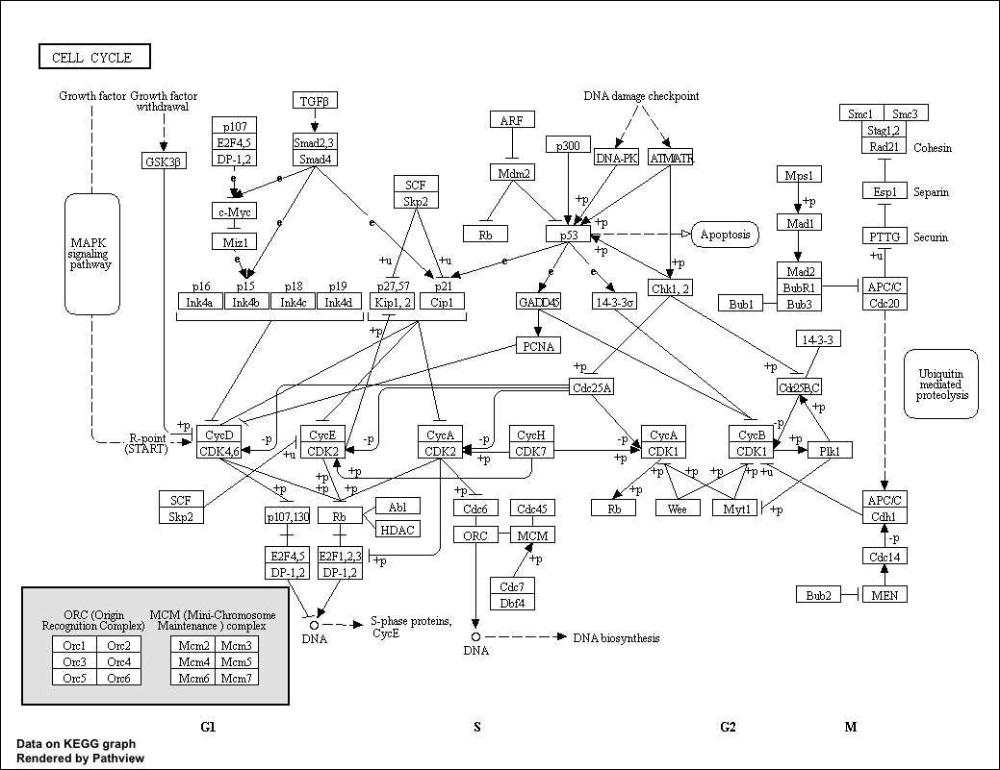

```{r setup, include=FALSE}
knitr::opts_chunk$set(echo = TRUE)
```

## Lect 16
See the live code version here
data comes frem HOX gene knockdown
 https://tinyurl.com/class16-bggn213


##Download and input data 
The data for for hands-on session comes from GEO entry: GSE37704, which is associated with the following publication:

Trapnell C, Hendrickson DG, Sauvageau M, Goff L et al. "Differential analysis of gene regulation at transcript resolution with RNA-seq". Nat Biotechnol 2013 Jan;31(1):46-53. PMID: 23222703
The authors report on differential analysis of lung fibroblasts in response to loss of the developmental transcription factor HOXA1.


# Import metadata and take a peak
```{r}
colData = read.csv("GSE37704_metadata.csv", row.names=1)
head(colData)
```

# Import countdata
```{r}
countData = read.csv("GSE37704_featurecounts.csv", row.names=1)
head(countData)
```
^^^ those 0's are kinda ugly and nasty, and will reduce our Power. Let's remove them

```{r}
countData<- countData[,-1]
```

how many genes? (aka # rows)
or, dimensions of dataframe
```{r}
dim(countData)
```
19808 genes(rows), and and 6 experiments(columns)

There are genes that have zero counts in all samples (ie columns). We should remove these.

First to identify the zero sum rows, uhhh, like the row some function
and for the rows that add to zero, I would like to eliminate those vvvv

First thing i'm doing is looking at the row sums
-some are equal to zero (TRUE)
-some do not equal zero (FALSE)

```{r}
inds <- rowSums(countData) != 0
countData <- countData[ inds, ]
head(countData)
```

want to check dimnesions vvv
```{r}
dim(countData)
```


```{r}
library(DESeq2)
```


```{r}
dds = DESeqDataSetFromMatrix(countData=countData,
                             colData=colData,
                             design=~condition)
dds = DESeq(dds)
```

Barry's answer
```{r}
res<- results(dds)
```

```{r}
plot(res$log2FoldChange, -log(res$padj))
```

If I want to change the color and axis labels, a line and such

```{r}
plot(res$log2FoldChange, -log(res$padj), col.axis = "blue")
```

post break
Let's add some color...

```{r}
mycols <- rep("gray", nrow(res))
mycols[ abs(res$log2FoldChange) > 2 ] <- "blue"
plot(res$log2FoldChange, -log(res$padj), col=mycols)
```

To add annotation to my gene list I will install some bioconductor packages

```{r}
##BiocManager::install("AnnotationDbi")
##BiocManager::install("org.Hs.eg.db")
```

```{r}
library(AnnotationDbi)
library(org.Hs.eg.db)

columns(org.Hs.eg.db)
```

Let's map our ENSEMBLE gene ids to the more conventional gene SYMBOL

```{r}
res$symbol <- mapIds(org.Hs.eg.db,
                    keys = row.names(res),
                    keytype="ENSEMBL",
                    column="SYMBOL",
                    multiVals="first")


res$entrz <- mapIds(org.Hs.eg.db,
                    keys = row.names(res),
                    keytype="ENSEMBL",
                    column="ENTREZID",
                    multiVals="first")

res$name <- mapIds(org.Hs.eg.db,
                    keys = row.names(res),
                    keytype="ENSEMBL",
                    column="GENENAME",
                    multiVals="first")

head(res)
```

save our annotated results
```{r}
write.csv(res, file="deseq_results.csv")
```

##Pathway Analysis
Section 2. Pathway Analysis
Here we are going to use the **gage** package for pathway analysis. Once we have a list of enriched pathways, we're going to use the **pathview** package to draw pathway diagrams, shading the molecules in the pathway by their degree of up/down-regulation.

```{r}
# Run in your R console (i.e. not your Rmarkdown doc!)
##BiocManager::install( c("pathview", "gage", "gageData") )
```

Load these packages 
```{r}
library(gage)
library(gageData)
library(pathview)
```

```{r}
data(kegg.sets.hs)
data(sigmet.idx.hs)

# Focus on signaling and metabolic pathways only
kegg.sets.hs = kegg.sets.hs[sigmet.idx.hs]

# Examine the first 3 pathways
head(kegg.sets.hs, 3)
```

Our input will be a vector of fold change 
values of ENTREZ gene ids as name
```{r}
foldchanges = res$log2FoldChange
names(foldchanges) = res$entrez
head(foldchanges)
```


```{r}
# Get the results
keggres = gage(foldchanges, gsets=kegg.sets.hs)
attributes(keggres)
# Look at the first few down (less) pathways
head(keggres$less)
```


```{r}
pathview(gene.data=foldchanges, pathway.id="hsa04110")
```

```{r}

```

Now Barry wants us to explore other pathways, so of course I want to look into cell adhesion related material, yup!
```{r}
pathview(gene.data=foldchanges, pathway.id="hsa04514")
```

hsa04514.pathview.png
```{r}
knitr::include_graphics("hsa04514.pathview.png")
```
That's a lot of information 0.0 
I wonder if there's a way to simplify all of this...


Try for high resolution figure 
(I wasn't fast enough at typing to follow along with Barry for this one)

