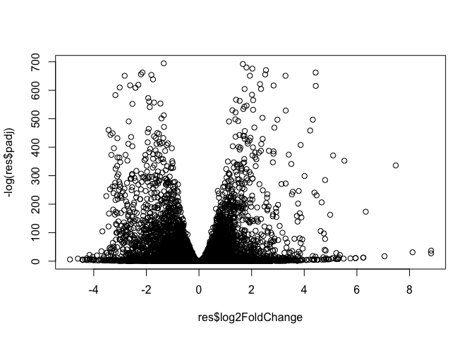
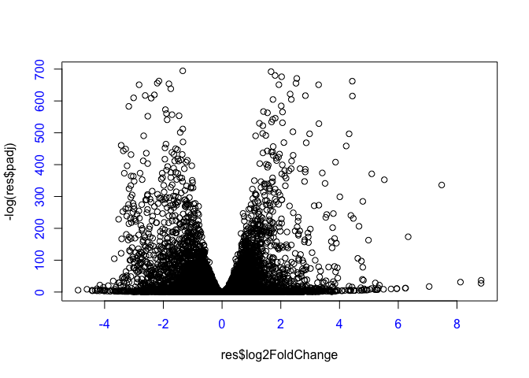
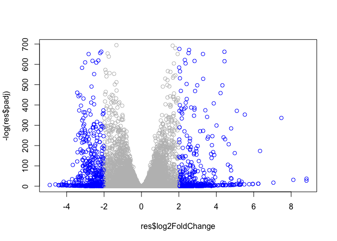
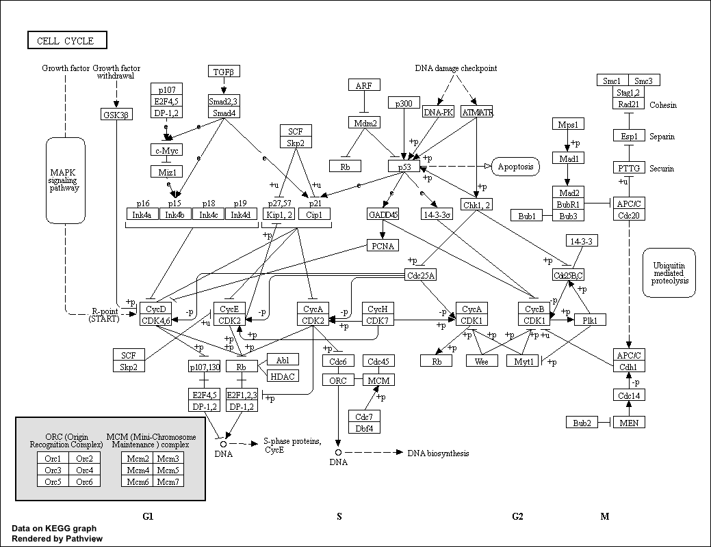
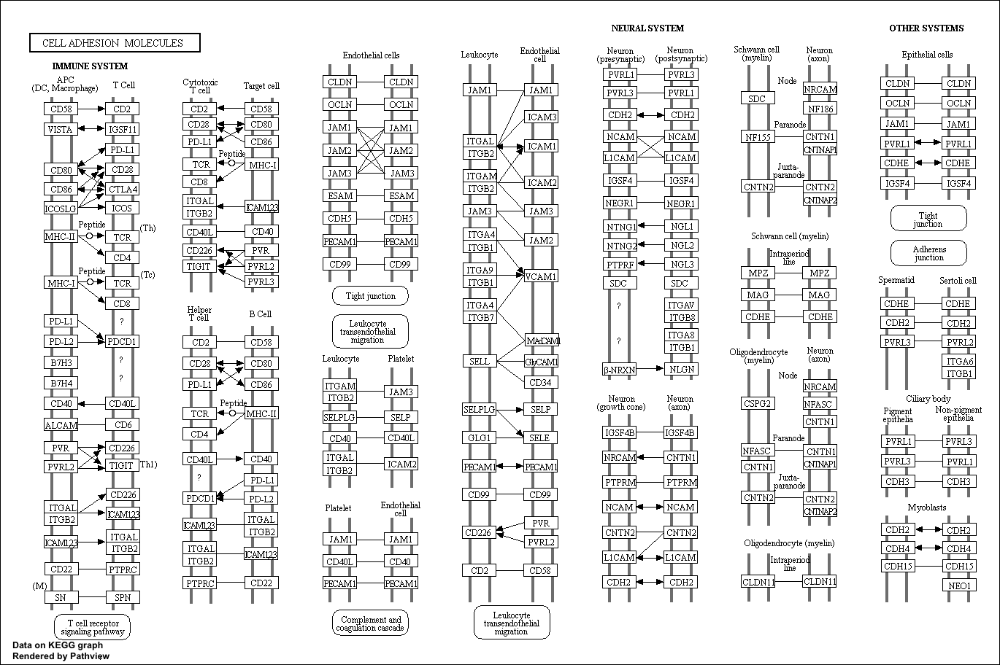

Class 16: Pathway Analysis from RNA-Seq Results
================
Rachael McVicar
2/28/2020

## Lect 16

See the live code version here data comes frem HOX gene knockdown
<https://tinyurl.com/class16-bggn213>

\#\#Download and input data The data for for hands-on session comes from
GEO entry: GSE37704, which is associated with the following publication:

Trapnell C, Hendrickson DG, Sauvageau M, Goff L et al. “Differential
analysis of gene regulation at transcript resolution with RNA-seq”. Nat
Biotechnol 2013 Jan;31(1):46-53. PMID: 23222703 The authors report on
differential analysis of lung fibroblasts in response to loss of the
developmental transcription factor HOXA1.

# Import metadata and take a peak

``` r
colData = read.csv("GSE37704_metadata.csv", row.names=1)
head(colData)
```

    ##               condition
    ## SRR493366 control_sirna
    ## SRR493367 control_sirna
    ## SRR493368 control_sirna
    ## SRR493369      hoxa1_kd
    ## SRR493370      hoxa1_kd
    ## SRR493371      hoxa1_kd

# Import countdata

``` r
countData = read.csv("GSE37704_featurecounts.csv", row.names=1)
head(countData)
```

    ##                 length SRR493366 SRR493367 SRR493368 SRR493369 SRR493370
    ## ENSG00000186092    918         0         0         0         0         0
    ## ENSG00000279928    718         0         0         0         0         0
    ## ENSG00000279457   1982        23        28        29        29        28
    ## ENSG00000278566    939         0         0         0         0         0
    ## ENSG00000273547    939         0         0         0         0         0
    ## ENSG00000187634   3214       124       123       205       207       212
    ##                 SRR493371
    ## ENSG00000186092         0
    ## ENSG00000279928         0
    ## ENSG00000279457        46
    ## ENSG00000278566         0
    ## ENSG00000273547         0
    ## ENSG00000187634       258

^^^ those 0’s are kinda ugly and nasty, and will reduce our Power. Let’s
remove them

``` r
countData<- countData[,-1]
```

how many genes? (aka \# rows) or, dimensions of dataframe

``` r
dim(countData)
```

    ## [1] 19808     6

19808 genes(rows), and and 6 experiments(columns)

There are genes that have zero counts in all samples (ie columns). We
should remove these.

First to identify the zero sum rows, uhhh, like the row some function
and for the rows that add to zero, I would like to eliminate those vvvv

First thing i’m doing is looking at the row sums -some are equal to zero
(TRUE) -some do not equal zero (FALSE)

``` r
inds <- rowSums(countData) != 0
countData <- countData[ inds, ]
head(countData)
```

    ##                 SRR493366 SRR493367 SRR493368 SRR493369 SRR493370 SRR493371
    ## ENSG00000279457        23        28        29        29        28        46
    ## ENSG00000187634       124       123       205       207       212       258
    ## ENSG00000188976      1637      1831      2383      1226      1326      1504
    ## ENSG00000187961       120       153       180       236       255       357
    ## ENSG00000187583        24        48        65        44        48        64
    ## ENSG00000187642         4         9        16        14        16        16

want to check dimnesions vvv

``` r
dim(countData)
```

    ## [1] 15975     6

``` r
library(DESeq2)
```

    ## Loading required package: S4Vectors

    ## Loading required package: stats4

    ## Loading required package: BiocGenerics

    ## Loading required package: parallel

    ## 
    ## Attaching package: 'BiocGenerics'

    ## The following objects are masked from 'package:parallel':
    ## 
    ##     clusterApply, clusterApplyLB, clusterCall, clusterEvalQ,
    ##     clusterExport, clusterMap, parApply, parCapply, parLapply,
    ##     parLapplyLB, parRapply, parSapply, parSapplyLB

    ## The following objects are masked from 'package:stats':
    ## 
    ##     IQR, mad, sd, var, xtabs

    ## The following objects are masked from 'package:base':
    ## 
    ##     anyDuplicated, append, as.data.frame, basename, cbind, colnames,
    ##     dirname, do.call, duplicated, eval, evalq, Filter, Find, get, grep,
    ##     grepl, intersect, is.unsorted, lapply, Map, mapply, match, mget,
    ##     order, paste, pmax, pmax.int, pmin, pmin.int, Position, rank,
    ##     rbind, Reduce, rownames, sapply, setdiff, sort, table, tapply,
    ##     union, unique, unsplit, which, which.max, which.min

    ## 
    ## Attaching package: 'S4Vectors'

    ## The following object is masked from 'package:base':
    ## 
    ##     expand.grid

    ## Loading required package: IRanges

    ## Loading required package: GenomicRanges

    ## Loading required package: GenomeInfoDb

    ## Loading required package: SummarizedExperiment

    ## Loading required package: Biobase

    ## Welcome to Bioconductor
    ## 
    ##     Vignettes contain introductory material; view with
    ##     'browseVignettes()'. To cite Bioconductor, see
    ##     'citation("Biobase")', and for packages 'citation("pkgname")'.

    ## Loading required package: DelayedArray

    ## Loading required package: matrixStats

    ## 
    ## Attaching package: 'matrixStats'

    ## The following objects are masked from 'package:Biobase':
    ## 
    ##     anyMissing, rowMedians

    ## Loading required package: BiocParallel

    ## 
    ## Attaching package: 'DelayedArray'

    ## The following objects are masked from 'package:matrixStats':
    ## 
    ##     colMaxs, colMins, colRanges, rowMaxs, rowMins, rowRanges

    ## The following objects are masked from 'package:base':
    ## 
    ##     aperm, apply, rowsum

``` r
dds = DESeqDataSetFromMatrix(countData=countData,
                             colData=colData,
                             design=~condition)
dds = DESeq(dds)
```

    ## estimating size factors

    ## estimating dispersions

    ## gene-wise dispersion estimates

    ## mean-dispersion relationship

    ## final dispersion estimates

    ## fitting model and testing

Barry’s answer

``` r
res<- results(dds)
```

``` r
plot(res$log2FoldChange, -log(res$padj))
```

<!-- -->

If I want to change the color and axis labels, a line and such

``` r
plot(res$log2FoldChange, -log(res$padj), col.axis = "blue")
```

<!-- -->

post break Let’s add some color…

``` r
mycols <- rep("gray", nrow(res))
mycols[ abs(res$log2FoldChange) > 2 ] <- "blue"
plot(res$log2FoldChange, -log(res$padj), col=mycols)
```

<!-- -->

To add annotation to my gene list I will install some bioconductor
packages

``` r
##BiocManager::install("AnnotationDbi")
##BiocManager::install("org.Hs.eg.db")
```

``` r
library(AnnotationDbi)
library(org.Hs.eg.db)
```

    ## 

``` r
columns(org.Hs.eg.db)
```

    ##  [1] "ACCNUM"       "ALIAS"        "ENSEMBL"      "ENSEMBLPROT"  "ENSEMBLTRANS"
    ##  [6] "ENTREZID"     "ENZYME"       "EVIDENCE"     "EVIDENCEALL"  "GENENAME"    
    ## [11] "GO"           "GOALL"        "IPI"          "MAP"          "OMIM"        
    ## [16] "ONTOLOGY"     "ONTOLOGYALL"  "PATH"         "PFAM"         "PMID"        
    ## [21] "PROSITE"      "REFSEQ"       "SYMBOL"       "UCSCKG"       "UNIGENE"     
    ## [26] "UNIPROT"

Let’s map our ENSEMBLE gene ids to the more conventional gene SYMBOL

``` r
res$symbol <- mapIds(org.Hs.eg.db,
                    keys = row.names(res),
                    keytype="ENSEMBL",
                    column="SYMBOL",
                    multiVals="first")
```

    ## 'select()' returned 1:many mapping between keys and columns

``` r
res$entrz <- mapIds(org.Hs.eg.db,
                    keys = row.names(res),
                    keytype="ENSEMBL",
                    column="ENTREZID",
                    multiVals="first")
```

    ## 'select()' returned 1:many mapping between keys and columns

``` r
res$name <- mapIds(org.Hs.eg.db,
                    keys = row.names(res),
                    keytype="ENSEMBL",
                    column="GENENAME",
                    multiVals="first")
```

    ## 'select()' returned 1:many mapping between keys and columns

``` r
head(res)
```

    ## log2 fold change (MLE): condition hoxa1 kd vs control sirna 
    ## Wald test p-value: condition hoxa1 kd vs control sirna 
    ## DataFrame with 6 rows and 9 columns
    ##                         baseMean     log2FoldChange              lfcSE
    ##                        <numeric>          <numeric>          <numeric>
    ## ENSG00000279457 29.9135794276176  0.179257083672691  0.324821565250145
    ## ENSG00000187634 183.229649921658   0.42645711840331  0.140265820376891
    ## ENSG00000188976 1651.18807619944 -0.692720464846371 0.0548465415913881
    ## ENSG00000187961 209.637938486147  0.729755610585229  0.131859899969346
    ## ENSG00000187583 47.2551232589398 0.0405765278756319  0.271892808601774
    ## ENSG00000187642 11.9797501642461  0.542810491577362  0.521559849534146
    ##                              stat               pvalue                 padj
    ##                         <numeric>            <numeric>            <numeric>
    ## ENSG00000279457 0.551863246932652    0.581042050747029    0.686554777832896
    ## ENSG00000187634  3.04034951107426  0.00236303749730955  0.00515718149494272
    ## ENSG00000188976 -12.6301576133497  1.4398954015367e-36 1.76548905389749e-35
    ## ENSG00000187961  5.53432552849562 3.12428248077692e-08 1.13412993107612e-07
    ## ENSG00000187583  0.14923722361139    0.881366448669145    0.919030615571379
    ## ENSG00000187642  1.04074439790984    0.297994191720984     0.40337930975409
    ##                      symbol       entrz
    ##                 <character> <character>
    ## ENSG00000279457          NA          NA
    ## ENSG00000187634      SAMD11      148398
    ## ENSG00000188976       NOC2L       26155
    ## ENSG00000187961      KLHL17      339451
    ## ENSG00000187583     PLEKHN1       84069
    ## ENSG00000187642       PERM1       84808
    ##                                                                     name
    ##                                                              <character>
    ## ENSG00000279457                                                       NA
    ## ENSG00000187634                 sterile alpha motif domain containing 11
    ## ENSG00000188976 NOC2 like nucleolar associated transcriptional repressor
    ## ENSG00000187961                              kelch like family member 17
    ## ENSG00000187583                 pleckstrin homology domain containing N1
    ## ENSG00000187642             PPARGC1 and ESRR induced regulator, muscle 1

save our annotated results

``` r
write.csv(res, file="deseq_results.csv")
```

\#\#Pathway Analysis Section 2. Pathway Analysis Here we are going to
use the **gage** package for pathway analysis. Once we have a list of
enriched pathways, we’re going to use the **pathview** package to draw
pathway diagrams, shading the molecules in the pathway by their degree
of up/down-regulation.

``` r
# Run in your R console (i.e. not your Rmarkdown doc!)
##BiocManager::install( c("pathview", "gage", "gageData") )
```

Load these packages

``` r
library(gage)
library(gageData)
library(pathview)
```

    ## ##############################################################################
    ## Pathview is an open source software package distributed under GNU General
    ## Public License version 3 (GPLv3). Details of GPLv3 is available at
    ## http://www.gnu.org/licenses/gpl-3.0.html. Particullary, users are required to
    ## formally cite the original Pathview paper (not just mention it) in publications
    ## or products. For details, do citation("pathview") within R.
    ## 
    ## The pathview downloads and uses KEGG data. Non-academic uses may require a KEGG
    ## license agreement (details at http://www.kegg.jp/kegg/legal.html).
    ## ##############################################################################

``` r
data(kegg.sets.hs)
data(sigmet.idx.hs)

# Focus on signaling and metabolic pathways only
kegg.sets.hs = kegg.sets.hs[sigmet.idx.hs]

# Examine the first 3 pathways
head(kegg.sets.hs, 3)
```

    ## $`hsa00232 Caffeine metabolism`
    ## [1] "10"   "1544" "1548" "1549" "1553" "7498" "9"   
    ## 
    ## $`hsa00983 Drug metabolism - other enzymes`
    ##  [1] "10"     "1066"   "10720"  "10941"  "151531" "1548"   "1549"   "1551"  
    ##  [9] "1553"   "1576"   "1577"   "1806"   "1807"   "1890"   "221223" "2990"  
    ## [17] "3251"   "3614"   "3615"   "3704"   "51733"  "54490"  "54575"  "54576" 
    ## [25] "54577"  "54578"  "54579"  "54600"  "54657"  "54658"  "54659"  "54963" 
    ## [33] "574537" "64816"  "7083"   "7084"   "7172"   "7363"   "7364"   "7365"  
    ## [41] "7366"   "7367"   "7371"   "7372"   "7378"   "7498"   "79799"  "83549" 
    ## [49] "8824"   "8833"   "9"      "978"   
    ## 
    ## $`hsa00230 Purine metabolism`
    ##   [1] "100"    "10201"  "10606"  "10621"  "10622"  "10623"  "107"    "10714" 
    ##   [9] "108"    "10846"  "109"    "111"    "11128"  "11164"  "112"    "113"   
    ##  [17] "114"    "115"    "122481" "122622" "124583" "132"    "158"    "159"   
    ##  [25] "1633"   "171568" "1716"   "196883" "203"    "204"    "205"    "221823"
    ##  [33] "2272"   "22978"  "23649"  "246721" "25885"  "2618"   "26289"  "270"   
    ##  [41] "271"    "27115"  "272"    "2766"   "2977"   "2982"   "2983"   "2984"  
    ##  [49] "2986"   "2987"   "29922"  "3000"   "30833"  "30834"  "318"    "3251"  
    ##  [57] "353"    "3614"   "3615"   "3704"   "377841" "471"    "4830"   "4831"  
    ##  [65] "4832"   "4833"   "4860"   "4881"   "4882"   "4907"   "50484"  "50940" 
    ##  [73] "51082"  "51251"  "51292"  "5136"   "5137"   "5138"   "5139"   "5140"  
    ##  [81] "5141"   "5142"   "5143"   "5144"   "5145"   "5146"   "5147"   "5148"  
    ##  [89] "5149"   "5150"   "5151"   "5152"   "5153"   "5158"   "5167"   "5169"  
    ##  [97] "51728"  "5198"   "5236"   "5313"   "5315"   "53343"  "54107"  "5422"  
    ## [105] "5424"   "5425"   "5426"   "5427"   "5430"   "5431"   "5432"   "5433"  
    ## [113] "5434"   "5435"   "5436"   "5437"   "5438"   "5439"   "5440"   "5441"  
    ## [121] "5471"   "548644" "55276"  "5557"   "5558"   "55703"  "55811"  "55821" 
    ## [129] "5631"   "5634"   "56655"  "56953"  "56985"  "57804"  "58497"  "6240"  
    ## [137] "6241"   "64425"  "646625" "654364" "661"    "7498"   "8382"   "84172" 
    ## [145] "84265"  "84284"  "84618"  "8622"   "8654"   "87178"  "8833"   "9060"  
    ## [153] "9061"   "93034"  "953"    "9533"   "954"    "955"    "956"    "957"   
    ## [161] "9583"   "9615"

Our input will be a vector of fold change values of ENTREZ gene ids as
name

``` r
foldchanges = res$log2FoldChange
names(foldchanges) = res$entrez
head(foldchanges)
```

    ## [1]  0.17925708  0.42645712 -0.69272046  0.72975561  0.04057653  0.54281049

``` r
# Get the results
keggres = gage(foldchanges, gsets=kegg.sets.hs)
attributes(keggres)
```

    ## $names
    ## [1] "greater" "less"    "stats"

``` r
# Look at the first few down (less) pathways
head(keggres$less)
```

    ##                                          p.geomean stat.mean p.val q.val
    ## hsa00232 Caffeine metabolism                    NA       NaN    NA    NA
    ## hsa00983 Drug metabolism - other enzymes        NA       NaN    NA    NA
    ## hsa00230 Purine metabolism                      NA       NaN    NA    NA
    ## hsa04514 Cell adhesion molecules (CAMs)         NA       NaN    NA    NA
    ## hsa04010 MAPK signaling pathway                 NA       NaN    NA    NA
    ## hsa04012 ErbB signaling pathway                 NA       NaN    NA    NA
    ##                                          set.size exp1
    ## hsa00232 Caffeine metabolism                    0   NA
    ## hsa00983 Drug metabolism - other enzymes        0   NA
    ## hsa00230 Purine metabolism                      0   NA
    ## hsa04514 Cell adhesion molecules (CAMs)         0   NA
    ## hsa04010 MAPK signaling pathway                 0   NA
    ## hsa04012 ErbB signaling pathway                 0   NA

``` r
pathview(gene.data=foldchanges, pathway.id="hsa04110")
```

    ## Warning: None of the genes or compounds mapped to the pathway!
    ## Argument gene.idtype or cpd.idtype may be wrong.

    ## 'select()' returned 1:1 mapping between keys and columns

    ## Info: Working in directory /Users/rachaelmcvicar/Desktop/UCSD Bioinformatics Class/bggn213_github/Lect16

    ## Info: Writing image file hsa04110.pathview.png

``` r

```


Now Barry wants us to explore other pathways, so of course I want to
look into cell adhesion related material, yup\!

``` r
pathview(gene.data=foldchanges, pathway.id="hsa04514")
```

    ## Warning: None of the genes or compounds mapped to the pathway!
    ## Argument gene.idtype or cpd.idtype may be wrong.

    ## 'select()' returned 1:1 mapping between keys and columns

    ## Info: Working in directory /Users/rachaelmcvicar/Desktop/UCSD Bioinformatics Class/bggn213_github/Lect16

    ## Info: Writing image file hsa04514.pathview.png

hsa04514.pathview.png

``` r

```

 That’s a lot of
information 0.0 I wonder if there’s a way to simplify all of this…

Try for high resolution figure (I wasn’t fast enough at typing to follow
along with Barry for this one)
