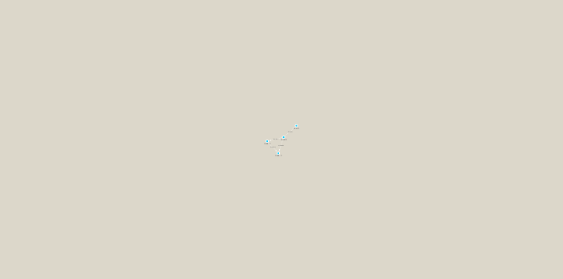

```{r setup, include=FALSE}
knitr::opts_chunk$set(echo = TRUE)
```

##TARA ocean data analysis
In this analysis we are using a Tara Ocean data and we have data from the bacterial dataset (Sunagawa et al. 2015) and also from the viral dataset (Brum et al. 2015). They have been examined in Lima-Mendez et al. (2015) and we have used the original relative abundances to visualize the data. Data were retrieved from: http://www.raeslab.org/companion/ocean-interactome.html

##Setup the R packages we need
I run the install in my R console NOT in my Rmarkdown doc
```{r}
BiocManager::install("RCy3")
install.packages("igraph")
install.packages("RColorBrewer")
```


```{r eval=FALSE}
library(RCy3)
library(igraph)
library(RColorBrewer)
```

```{r}
library(RCy3)

# Test the connection to Cytoscape.
cytoscapePing()
```
woot!

We can test things further bymaking a little sample network and sending it to cytoscape
```{r}
g <- makeSimpleIgraph()
createNetworkFromIgraph(g,"myGraph")
```

```{r}
fig <- exportImage(filename="demo", type="png", height=350)

```

If you turn to your Cytoscape window you should now see an updated stylized network displayed (see below).
```{r}
setVisualStyle("Marquee")

fig <- exportImage(filename="demo_marquee", type="png", height=350)


```

```{r}
styles <- getVisualStyleNames()
styles
```


## scripts for processing located in "inst/data-raw/"
## Have a peak at the first 6 rows
Read our input data for this sesison
```{r}

prok_vir_cor <- read.delim("virus_prok_cor_abundant.tsv", stringsAsFactors = FALSE)


head(prok_vir_cor)
```

cool, now...
```{r}
g <- graph.data.frame(prok_vir_cor, directed = FALSE)
```

```{r}
plot(g)
```
Ewwwwwww, lets fix this, labels are definitely in the way
Lol, in the words of Barry "This is a hot mess!" 
So turn off the labels and make the ...
```{r}
plot(g, vertex.label=NA)
```

```{r}
plot(g, vertex.size=3, vertex.label=NA)
```

Send to cytoscape
```{r}
createNetworkFromIgraph(g,"myIgraph")
```


##Network community detection
Community structure detection algorithms try to find dense sub-graphs within larger network graphs (i.e. clusters of well connected nodes that are densely connected themselves but sparsely connected to other nodes outside the cluster) . Here we use the classic Girvan & Newman betweenness clustering method. The igraph package has lots of different community detection algorithms (i.e. different methods for finding communities).

```{r}
cb <- cluster_edge_betweenness(g)
```

```{r}
plot(cb, y=g, vertex.label=NA,  vertex.size=3)
```

just one more thing!

###Centrality analysis
Centrality gives an estimation on how important a node or edge is for the connectivity (or the information flow) of a network. It is a particularly useful parameter in signaling networks and it is often used when trying to find drug targets for example.

Centrality analysis often aims to answer the following question: Which nodes are the most important and why?

One centrality method that you can often find in publications is the Google PageRank score. For the explanation of the PageRank algorithm, see the following webpage: http://infolab.stanford.edu/~backrub/google.html

```{r}
pr <- page_rank(g)
head(pr$vector)

```

Make a size vector btwn 2 and 20 for node plotting size
```{r}
library("BBmisc")
v.size <- BBmisc::normalize(pr$vector, range=c(2,20), method="range")
plot(g, vertex.size=v.size, vertex.label=NA)
```

