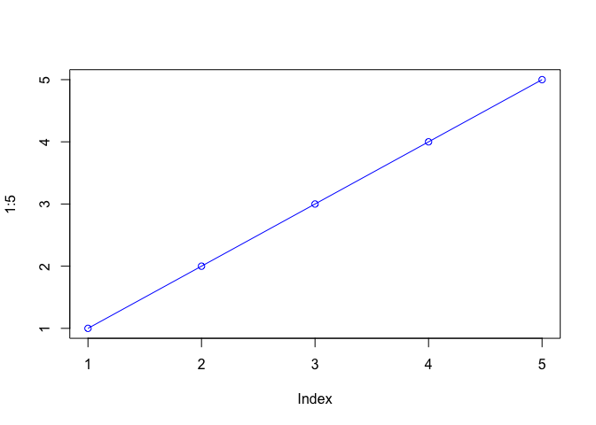
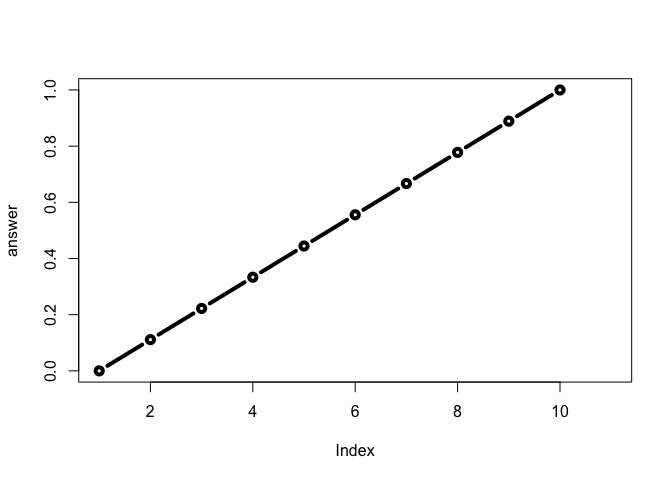
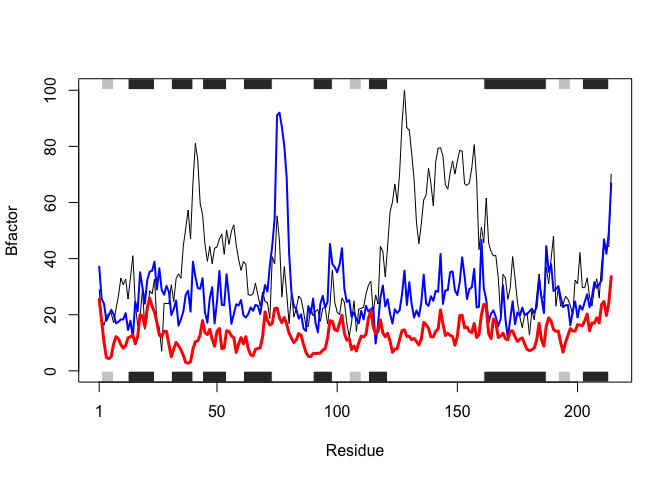

Lecture 6: R functions
================
Rachael McVicar
1/24/2020

## Section 1: Improving analysis code by writing functions

let’s insert a code chunk with the shortcut `Option-CMD-i`

``` r
plot(1:5, col="blue", type="o")
```

<!-- -->

``` r
x<- (1:10)
x
```

    ##  [1]  1  2  3  4  5  6  7  8  9 10

## More on reading input files

We will use the read.table() function again

``` r
read.table("test1.txt", header=TRUE, sep= ",")
```

    ##   Col1 Col2 Col3
    ## 1    1    2    3
    ## 2    4    5    6
    ## 3    7    8    9
    ## 4    a    b    c

``` r
read.table("test2.txt", header=TRUE, sep="$")
```

    ##   Col1 Col2 Col3
    ## 1    1    2    3
    ## 2    4    5    6
    ## 3    7    8    9
    ## 4    a    b    c

``` r
read.table("test3.txt")
```

    ##   V1 V2 V3
    ## 1  1  6  a
    ## 2  2  7  b
    ## 3  3  8  c
    ## 4  4  9  d
    ## 5  5 10  e

### back after break

### ‘R’ first function (coding puns woooooo)

This is an example function named add with input `x` and `y`

``` r
add <- function(x, y=1) {
 # Sum the input x and y
 x + y
}
```

let’s try using it

``` r
add(x=c(1,6,2), 4)
```

    ## [1]  5 10  6

\#2nd function wooo A 2nd function to re-scale data to lie between 0 and
1

``` r
rescale <- function(x) {
 rng <-range(x)
 (x - rng[1]) / (rng[2] - rng[1])
}
```

Lets test this
    function

``` r
rescale(c(1:10,30,100))
```

    ##  [1] 0.00000000 0.01010101 0.02020202 0.03030303 0.04040404 0.05050505
    ##  [7] 0.06060606 0.07070707 0.08080808 0.09090909 0.29292929 1.00000000

``` r
rescale(c(1:10, NA))
```

    ##  [1] NA NA NA NA NA NA NA NA NA NA NA

``` r
x<- c(1:10, NA)
rescale(c(1:10, NA))
```

    ##  [1] NA NA NA NA NA NA NA NA NA NA NA

``` r
rng <- (range(x, na.rm=TRUE))
```

Fix for missing values NAs

``` r
rescale2<- function(x) {
rng <- (range(x, na.rm=TRUE))
 (x - rng[1]) / (rng[2] - rng[1])
}
```

``` r
rescale2(c(1:10, NA))
```

    ##  [1] 0.0000000 0.1111111 0.2222222 0.3333333 0.4444444 0.5555556 0.6666667
    ##  [8] 0.7777778 0.8888889 1.0000000        NA

Taking things a bit too far…. :b

``` r
rescale3 <- function(x, na.rm=TRUE, plot=FALSE) {
 if(na.rm) {
 rng <-range(x, na.rm=na.rm)
 } else {
 rng <-range(x)
 }
 print("Hello")
 answer <- (x - rng[1]) / (rng[2] - rng[1])
 print("is it me you are looking for?")
 if(plot) {
 plot(answer, typ="b", lwd=4)
 }
 print("I can see it in ...")
}
```

``` r
rescale3(x, plot=TRUE)
```

    ## [1] "Hello"
    ## [1] "is it me you are looking for?"

<!-- -->

    ## [1] "I can see it in ..."

## Section 2: Writing and calling a function

\#Working with the bio3d package To use the functions from any package
we have installed we use the `library()` function to load it.

``` r
library(bio3d)
```

# Can you improve this analysis code?

``` r
s1 <- read.pdb("4AKE") # kinase with drug
```

    ##   Note: Accessing on-line PDB file

``` r
s2 <- read.pdb("1AKE") # kinase no drug
```

    ##   Note: Accessing on-line PDB file
    ##    PDB has ALT records, taking A only, rm.alt=TRUE

``` r
s3 <- read.pdb("1E4Y") # kinase with drug
```

    ##   Note: Accessing on-line PDB file

``` r
s1.chainA <- trim.pdb(s1, chain="A", elety="CA")
s2.chainA <- trim.pdb(s2, chain="A", elety="CA")
s3.chainA <- trim.pdb(s3, chain="A", elety="CA")
s1.b <- s1.chainA$atom$b
s2.b <- s2.chainA$atom$b
s3.b <- s3.chainA$atom$b
plotb3(s1.b, sse=s1.chainA, typ="l", ylab="Bfactor")
```

<!-- -->

``` r
plotb3(s2.b, sse=s2.chainA, typ="l", ylab="Bfactor")
```

<!-- -->

``` r
plotb3(s3.b, sse=s3.chainA, typ="l", ylab="Bfactor")
```

<!-- -->

``` r
s1<- read.pdb("4AKE")
```

    ##   Note: Accessing on-line PDB file

    ## Warning in get.pdb(file, path = tempdir(), verbose = FALSE): /var/folders/w1/
    ## dt5r2p490v909vgp9lxyj8lr0000gn/T//Rtmpw6vVl9/4AKE.pdb exists. Skipping download

``` r
class(s1)
```

    ## [1] "pdb" "sse"

``` r
str(s1)
```

    ## List of 8
    ##  $ atom  :'data.frame':  3459 obs. of  16 variables:
    ##   ..$ type  : chr [1:3459] "ATOM" "ATOM" "ATOM" "ATOM" ...
    ##   ..$ eleno : int [1:3459] 1 2 3 4 5 6 7 8 9 10 ...
    ##   ..$ elety : chr [1:3459] "N" "CA" "C" "O" ...
    ##   ..$ alt   : chr [1:3459] NA NA NA NA ...
    ##   ..$ resid : chr [1:3459] "MET" "MET" "MET" "MET" ...
    ##   ..$ chain : chr [1:3459] "A" "A" "A" "A" ...
    ##   ..$ resno : int [1:3459] 1 1 1 1 1 1 1 1 2 2 ...
    ##   ..$ insert: chr [1:3459] NA NA NA NA ...
    ##   ..$ x     : num [1:3459] -10.93 -9.9 -9.17 -9.8 -10.59 ...
    ##   ..$ y     : num [1:3459] -24.9 -24.4 -23.3 -22.3 -24 ...
    ##   ..$ z     : num [1:3459] -9.52 -10.48 -9.81 -9.35 -11.77 ...
    ##   ..$ o     : num [1:3459] 1 1 1 1 1 1 1 1 1 1 ...
    ##   ..$ b     : num [1:3459] 41.5 29 27.9 26.4 34.2 ...
    ##   ..$ segid : chr [1:3459] NA NA NA NA ...
    ##   ..$ elesy : chr [1:3459] "N" "C" "C" "O" ...
    ##   ..$ charge: chr [1:3459] NA NA NA NA ...
    ##  $ xyz   : 'xyz' num [1, 1:10377] -10.93 -24.89 -9.52 -9.9 -24.42 ...
    ##  $ seqres: Named chr [1:428] "MET" "ARG" "ILE" "ILE" ...
    ##   ..- attr(*, "names")= chr [1:428] "A" "A" "A" "A" ...
    ##  $ helix :List of 4
    ##   ..$ start: Named num [1:19] 13 31 44 61 75 90 113 161 202 13 ...
    ##   .. ..- attr(*, "names")= chr [1:19] "" "" "" "" ...
    ##   ..$ end  : Named num [1:19] 24 40 54 73 77 98 121 187 213 24 ...
    ##   .. ..- attr(*, "names")= chr [1:19] "" "" "" "" ...
    ##   ..$ chain: chr [1:19] "A" "A" "A" "A" ...
    ##   ..$ type : chr [1:19] "5" "1" "1" "1" ...
    ##  $ sheet :List of 4
    ##   ..$ start: Named num [1:14] 192 105 2 81 27 123 131 192 105 2 ...
    ##   .. ..- attr(*, "names")= chr [1:14] "" "" "" "" ...
    ##   ..$ end  : Named num [1:14] 197 110 7 84 29 126 134 197 110 7 ...
    ##   .. ..- attr(*, "names")= chr [1:14] "" "" "" "" ...
    ##   ..$ chain: chr [1:14] "A" "A" "A" "A" ...
    ##   ..$ sense: chr [1:14] "0" "1" "1" "1" ...
    ##  $ calpha: logi [1:3459] FALSE TRUE FALSE FALSE FALSE FALSE ...
    ##  $ remark:List of 1
    ##   ..$ biomat:List of 4
    ##   .. ..$ num   : int 1
    ##   .. ..$ chain :List of 1
    ##   .. .. ..$ : chr [1:2] "A" "B"
    ##   .. ..$ mat   :List of 1
    ##   .. .. ..$ :List of 1
    ##   .. .. .. ..$ A B: num [1:3, 1:4] 1 0 0 0 1 0 0 0 1 0 ...
    ##   .. ..$ method: chr "AUTHOR"
    ##  $ call  : language read.pdb(file = "4AKE")
    ##  - attr(*, "class")= chr [1:2] "pdb" "sse"

``` r
aa321(s1$seqres)
```

    ##   [1] "M" "R" "I" "I" "L" "L" "G" "A" "P" "G" "A" "G" "K" "G" "T" "Q" "A" "Q"
    ##  [19] "F" "I" "M" "E" "K" "Y" "G" "I" "P" "Q" "I" "S" "T" "G" "D" "M" "L" "R"
    ##  [37] "A" "A" "V" "K" "S" "G" "S" "E" "L" "G" "K" "Q" "A" "K" "D" "I" "M" "D"
    ##  [55] "A" "G" "K" "L" "V" "T" "D" "E" "L" "V" "I" "A" "L" "V" "K" "E" "R" "I"
    ##  [73] "A" "Q" "E" "D" "C" "R" "N" "G" "F" "L" "L" "D" "G" "F" "P" "R" "T" "I"
    ##  [91] "P" "Q" "A" "D" "A" "M" "K" "E" "A" "G" "I" "N" "V" "D" "Y" "V" "L" "E"
    ## [109] "F" "D" "V" "P" "D" "E" "L" "I" "V" "D" "R" "I" "V" "G" "R" "R" "V" "H"
    ## [127] "A" "P" "S" "G" "R" "V" "Y" "H" "V" "K" "F" "N" "P" "P" "K" "V" "E" "G"
    ## [145] "K" "D" "D" "V" "T" "G" "E" "E" "L" "T" "T" "R" "K" "D" "D" "Q" "E" "E"
    ## [163] "T" "V" "R" "K" "R" "L" "V" "E" "Y" "H" "Q" "M" "T" "A" "P" "L" "I" "G"
    ## [181] "Y" "Y" "S" "K" "E" "A" "E" "A" "G" "N" "T" "K" "Y" "A" "K" "V" "D" "G"
    ## [199] "T" "K" "P" "V" "A" "E" "V" "R" "A" "D" "L" "E" "K" "I" "L" "G" "M" "R"
    ## [217] "I" "I" "L" "L" "G" "A" "P" "G" "A" "G" "K" "G" "T" "Q" "A" "Q" "F" "I"
    ## [235] "M" "E" "K" "Y" "G" "I" "P" "Q" "I" "S" "T" "G" "D" "M" "L" "R" "A" "A"
    ## [253] "V" "K" "S" "G" "S" "E" "L" "G" "K" "Q" "A" "K" "D" "I" "M" "D" "A" "G"
    ## [271] "K" "L" "V" "T" "D" "E" "L" "V" "I" "A" "L" "V" "K" "E" "R" "I" "A" "Q"
    ## [289] "E" "D" "C" "R" "N" "G" "F" "L" "L" "D" "G" "F" "P" "R" "T" "I" "P" "Q"
    ## [307] "A" "D" "A" "M" "K" "E" "A" "G" "I" "N" "V" "D" "Y" "V" "L" "E" "F" "D"
    ## [325] "V" "P" "D" "E" "L" "I" "V" "D" "R" "I" "V" "G" "R" "R" "V" "H" "A" "P"
    ## [343] "S" "G" "R" "V" "Y" "H" "V" "K" "F" "N" "P" "P" "K" "V" "E" "G" "K" "D"
    ## [361] "D" "V" "T" "G" "E" "E" "L" "T" "T" "R" "K" "D" "D" "Q" "E" "E" "T" "V"
    ## [379] "R" "K" "R" "L" "V" "E" "Y" "H" "Q" "M" "T" "A" "P" "L" "I" "G" "Y" "Y"
    ## [397] "S" "K" "E" "A" "E" "A" "G" "N" "T" "K" "Y" "A" "K" "V" "D" "G" "T" "K"
    ## [415] "P" "V" "A" "E" "V" "R" "A" "D" "L" "E" "K" "I" "L" "G"

Can we take some complicated real life code, simplify, and apply it to
other real like protein structures

``` r
plotb3(s1.b, sse=s1.chainA, typ="l", ylab="Bfactor")
points(s2.b, col="blue", typ="l", lwd=2)
points(s3.b, col="red", typ="l", lwd=3)
```

<!-- -->
