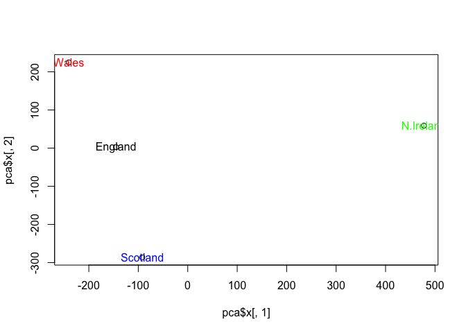

class\_lect9\_Machine Learning pt.1
================
Rachael McVicar
2/5/2020

\#\#K-means clustering

Let’s try the `kmeans()`function in R to cluster some made-up example
data.

``` r
tmp <- c(rnorm(30,-3), rnorm(30,3))
x <- cbind(x=tmp, y=rev(tmp))
plot(x)
```

<!-- -->

Use the kmeans()function setting k to 2 and nstart=20

``` r
km <- kmeans(x, centers=2, nstart = 20)
km
```

    ## K-means clustering with 2 clusters of sizes 30, 30
    ## 
    ## Cluster means:
    ##           x         y
    ## 1  3.255101 -3.291516
    ## 2 -3.291516  3.255101
    ## 
    ## Clustering vector:
    ##  [1] 2 2 2 2 2 2 2 2 2 2 2 2 2 2 2 2 2 2 2 2 2 2 2 2 2 2 2 2 2 2 1 1 1 1 1 1 1 1
    ## [39] 1 1 1 1 1 1 1 1 1 1 1 1 1 1 1 1 1 1 1 1 1 1
    ## 
    ## Within cluster sum of squares by cluster:
    ## [1] 91.00061 91.00061
    ##  (between_SS / total_SS =  87.6 %)
    ## 
    ## Available components:
    ## 
    ## [1] "cluster"      "centers"      "totss"        "withinss"     "tot.withinss"
    ## [6] "betweenss"    "size"         "iter"         "ifault"

What is in the output object `km` I can use the `attributes()` functiond
to find this ratio :-)

``` r
attributes(km)
```

    ## $names
    ## [1] "cluster"      "centers"      "totss"        "withinss"     "tot.withinss"
    ## [6] "betweenss"    "size"         "iter"         "ifault"      
    ## 
    ## $class
    ## [1] "kmeans"

Q. How many points are in each cluster?

``` r
km$size
```

    ## [1] 30 30

Q. What ‘component’ of your result object details - cluster size? -
cluster
    assignment/membership?

``` r
km$cluster
```

    ##  [1] 2 2 2 2 2 2 2 2 2 2 2 2 2 2 2 2 2 2 2 2 2 2 2 2 2 2 2 2 2 2 1 1 1 1 1 1 1 1
    ## [39] 1 1 1 1 1 1 1 1 1 1 1 1 1 1 1 1 1 1 1 1 1 1

let’s check how many 2’s and 1’s are in this vector with the `table()`
function.

``` r
table(km$cluster)
```

    ## 
    ##  1  2 
    ## 30 30

Q. What ‘component’ of your result object details - cluster center?

``` r
km$centers
```

    ##           x         y
    ## 1  3.255101 -3.291516
    ## 2 -3.291516  3.255101

Plot x colored by thekmeans cluster assignment and add cluster
assignment and add cluster centers as blue points

``` r
plot(x, col=km$cluster)
points(km$centers, col="blue", pch=15)
```

<!-- -->

\#\#Hierarchial clustering in r

The `hclust()` function is the main Hierarchial clustering methods in R
and it **must** be passed in a *distance matrix* as input, not your raw
data\!

``` r
hc<- hclust( dist(x))
hc
```

    ## 
    ## Call:
    ## hclust(d = dist(x))
    ## 
    ## Cluster method   : complete 
    ## Distance         : euclidean 
    ## Number of objects: 60

``` r
plot(hc)
abline(h=6, col="red", lty=2)
```

<!-- -->

``` r
cutree(hc, h=6)
```

    ##  [1] 1 2 2 1 1 2 2 2 2 1 2 1 2 1 2 1 2 2 1 1 2 2 1 1 1 2 1 2 2 1 3 4 4 3 4 3 3 3
    ## [39] 4 4 3 3 4 4 3 4 3 4 3 4 3 4 4 4 4 3 3 4 4 3

``` r
table(cutree(hc, h=3.5))
```

    ## 
    ##  1  2  3  4  5  6  7  8 
    ##  6  6  8 10  8 10  6  6

You can also ask `cutree()` for the `k` number of groups that you
    want

``` r
cutree(hc, k=5)
```

    ##  [1] 1 2 2 1 1 2 2 2 2 1 2 1 2 1 2 1 2 2 1 1 2 2 1 1 1 2 1 2 2 1 3 4 4 3 4 3 3 3
    ## [39] 4 5 3 3 5 4 3 4 3 5 3 4 3 4 4 4 5 3 3 5 5 3

## Some more messy data to cluster

``` r
 x <- rbind(
 matrix(rnorm(100, mean=0, sd=0.3), ncol = 2), # c1
 matrix(rnorm(100, mean=1, sd=0.3), ncol = 2), # c2
 matrix(c(rnorm(50, mean=1, sd=0.3), # c3
 rnorm(50, mean=0, sd=0.3)), ncol = 2))
colnames(x) <- c("x", "y")
plot(x)
```

<!-- -->

``` r
col <- as.factor( rep(c("c1","c2","c3"), each=50) )
plot(x, col=col)
```

<!-- -->

Q. Use the dist(), hclust(), plot() and cutree() functions to return 2
and 3 clusters Q. How does this compare to your known ‘col’ groups?

``` r
hc <- hclust(dist(x))
plot(hc)
```

<!-- -->

``` r
grps <- cutree(hc, k=3)
grps
```

    ##   [1] 1 1 2 1 1 1 1 1 1 1 1 1 2 1 1 1 2 1 1 2 1 1 1 2 1 1 1 1 1 1 3 1 1 1 1 1 1
    ##  [38] 1 2 2 1 1 1 1 1 1 1 1 2 1 3 3 3 3 3 3 3 3 3 3 3 3 3 3 3 3 3 3 3 3 3 3 3 3
    ##  [75] 3 3 3 3 3 3 3 3 3 3 3 3 3 3 3 3 3 3 3 3 3 3 3 3 3 3 2 2 2 3 3 2 2 3 2 2 2
    ## [112] 3 2 2 2 3 3 2 2 3 2 3 3 2 2 2 2 3 3 3 2 2 2 2 2 3 3 3 2 3 2 3 3 3 2 3 2 3
    ## [149] 2 2

``` r
table(grps)
```

    ## grps
    ##  1  2  3 
    ## 41 37 72

``` r
plot(x, col=grps)
```

<!-- -->

``` r
table(grps, col)
```

    ##     col
    ## grps c1 c2 c3
    ##    1 41  0  0
    ##    2  8  0 29
    ##    3  1 50 21

\#\#\#Hands on with Principal Component Analysis (PCA) The main function
in base R for PCA is called `prcomp()`. Here we will use PCA to examine
the funny food that folk eat in the UK and N. Ireland.

Import the CSV file first:

``` r
x <- read.csv("UK_foods.csv", row.names = 1)
x
```

    ##                     England Wales Scotland N.Ireland
    ## Cheese                  105   103      103        66
    ## Carcass_meat            245   227      242       267
    ## Other_meat              685   803      750       586
    ## Fish                    147   160      122        93
    ## Fats_and_oils           193   235      184       209
    ## Sugars                  156   175      147       139
    ## Fresh_potatoes          720   874      566      1033
    ## Fresh_Veg               253   265      171       143
    ## Other_Veg               488   570      418       355
    ## Processed_potatoes      198   203      220       187
    ## Processed_Veg           360   365      337       334
    ## Fresh_fruit            1102  1137      957       674
    ## Cereals                1472  1582     1462      1494
    ## Beverages                57    73       53        47
    ## Soft_drinks            1374  1256     1572      1506
    ## Alcoholic_drinks        375   475      458       135
    ## Confectionery            54    64       62        41

``` r
barplot(as.matrix(x), beside=T, col=rainbow(nrow(x)))
```

<!-- -->

luxury to do this plot in the biology
world

``` r
pairs(x, col=rainbow(10), pch=16)
```

<!-- -->

``` r
pca <- prcomp( t(x) )
```

``` r
summary(pca)
```

    ## Importance of components:
    ##                             PC1      PC2      PC3       PC4
    ## Standard deviation     324.1502 212.7478 73.87622 4.189e-14
    ## Proportion of Variance   0.6744   0.2905  0.03503 0.000e+00
    ## Cumulative Proportion    0.6744   0.9650  1.00000 1.000e+00

``` r
plot( pca$x[,1], pca$x[,2])
text(pca$x[,1], pca$x[,2], colnames(x),col=c("black", "red", "blue", "green"))
```

<!-- -->
